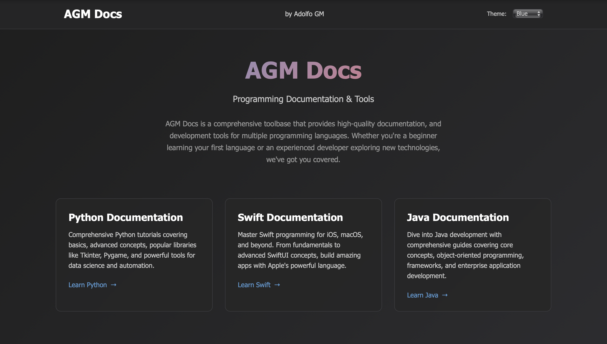

# AGM Docs

## Programming Documentation & Tools

AGM Docs is a comprehensive toolbase that provides high-quality documentation, 
and development tools for multiple programming languages. Whether you're 
a beginner learning your first language or an experienced developer exploring new 
technologies, we've got you covered.

